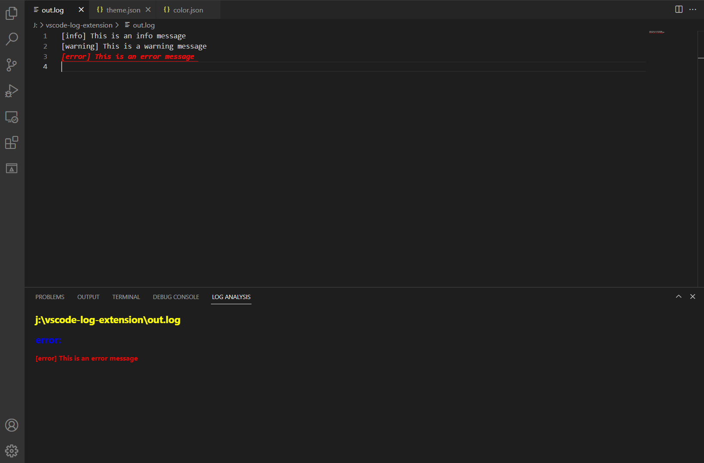

# Example

This is an example configuration to analysis log file.



## Use the following configuration file:

theme.json:
```json
{
    "highlight": {
      "error_info_1": {
          "regex": "\\[error\\]",
          "theme": "error_format",
          "tilEnd": true
      }
    },
    "hidden": [
      "hidden_error_1",
      "hidden_error_2"
    ],
    "panel": [
      "error_info_1"
    ],
    "jump": [
      "error_info_1" 
    ]
}
```

color.json:
```json
{
    "error_format": {
      "foreground": "#ff0000",
      "italic": true,
      "bold": true,
      "underline": true
    }
}
```

Then open a log file with the following content:
```txt
[info] This is an info message
[warning] This is a warning message
[error] This is an error message 
```